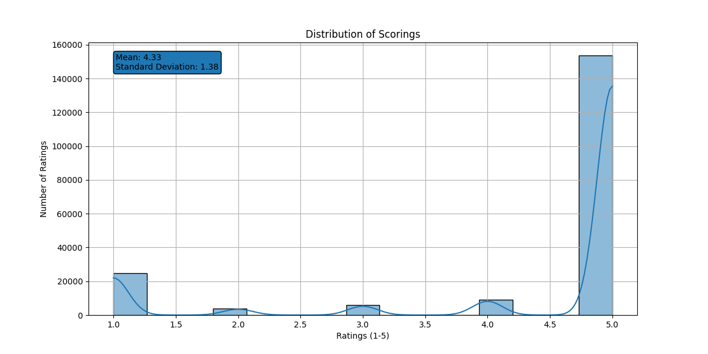
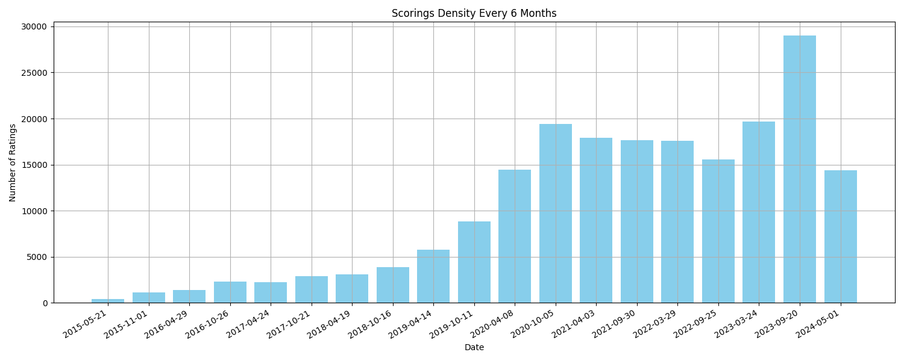
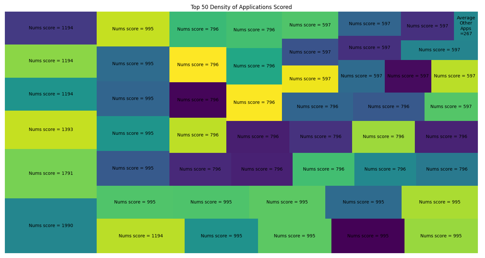
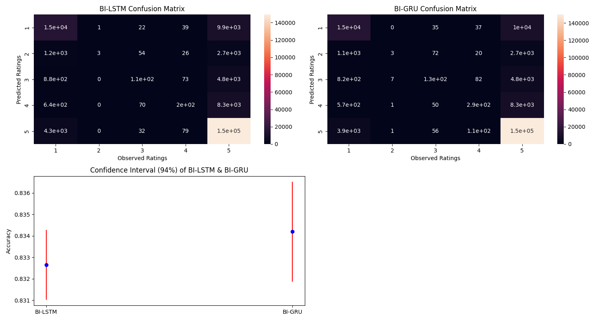

# App Store Review Sentiment Classifier: Bidirectional RNNs with Subword Embeddings

## Overview
This project implements a multi-class sentiment analysis pipeline using Bidirectional LSTMs and GRUs to classify Amazon Appstore reviews into five sentiment levels. By integrating FastText embeddings, the system effectively captures subword-level information to handle typos and slang common in user feedback. The workflow encompasses the full ML lifecycle—from scalable PySpark preprocessing to a comparative evaluation of recurrent architectures via K-fold cross-validation—resulting in a robust tool for real-time sentiment inference.

## Dataset Information 

The dataset consists of user reviews and star ratings harvested from the Amazon Appstore. Initial processing is performed using **PySpark** to handle the high volume of text data and associated metadata across thousands of unique applications.

* **Primary File:** `reviews.parquet` (Initial Ingestion)
* **Processed Outputs:** `setup_dataset.pkl`, `processed_reviews.txt`
* **Classes:** 5 Sentiment Categories (mapped from 1-5 star ratings)
* **Sequence Length:** 150 tokens per input (padded/truncated)
* **Embedding Dimension:** 130 dimensions for complex relationships

### Dataset Variables

| Variable | Description |
| :--- | :--- |
| **review** | The raw text feedback provided by the user. Normalized via NFKD and tokenized using regex patterns. |
| **star** | The original numerical rating (1-5). In the preprocessing stage, this is shifted to a 0-4 range for model compatibility. |
| **date** | The timestamp of the review, utilized for temporal density and trend analysis. |
| **package_name** | The unique identifier for the application being reviewed, used to analyze application density. |

### Class Mapping & EDA
The system interprets the star ratings as a proxy for sentiment intensity:
* **1 Star (Class 0)**: Strongly Dissatisfied
* **2 Stars (Class 1)**: Dissatisfied
* **3 Stars (Class 2)**: Neutral Sentiment
* **4 Stars (Class 3)**: Satisfied
* **5 Stars (Class 4)**: Strongly Satisfied

* **Sentiment Distribution Insights**:
    
    * The dataset shows a significant **class imbalance**, with a high density of 5-star ("Strongly Satisfied") reviews. This distribution explains why the models achieve high overall accuracy but may require further tuning—such as class weighting—to improve precision for "Neutral" or "Dissatisfied" categories.

* **Market Trends**:
    
    * Analyzing the scoring density over 6-month intervals reveals fluctuations in user engagement and sentiment trends, providing valuable context for how the app's reception has evolved over time.

* **Domain Coverage**:
    
    * The dataset was analyzed for application density. The treemap below illustrates the distribution of reviews across the Top 50 applications in the dataset.

## File Description

| File Name | Description |
| :--- | :--- |
| **EDA_First_Preprocess.py** | Initial data processing script using **PySpark**. Handles data cleaning, label scaling, and generates exploratory visualizations like application density and temporal scoring trends. |
| **Second_Preprocess.py** | Manages text vectorization and embedding. It normalizes text, trains the **FastText** model, and transforms raw strings into padded numerical sequences. |
| **Cross_Validation.py** | The core research script. It defines the `Bidirectional_Extended_RNNs` class and runs a 5-fold cross-validation pipeline to compare **LSTM** vs. **GRU** architectures. |
| **Final_Training.py** | Orchestrates the final model training session based on the optimal parameters found during validation and serializes the weights for production use. |
| **Inference.py** | A real-time prediction script that allows users to input custom text reviews and receive a predicted sentiment level and equivalent star rating. |
| **Comparison_2_Models.png** | A statistical visualization showing the accuracy and confidence intervals of the Bidirectional LSTM and GRU models. |
| **Density_Applications_Scored.png** | A treemap visualization illustrating the distribution of reviews across the Top 50 applications in the dataset. |
| **Scorings_Distribution.png** | A histogram showing the frequency of each star rating (1-5) to identify class imbalances in the training data. |
| **Scorings_Density_Every_6_Months.png** | KDE plot showing the distribution and shifts of review scores over 6-month temporal intervals. |
| **setup_dataset.pkl** | The cleaned and processed version of the original parquet data, saved in a format optimized for rapid loading during training. |
| **model.pkl** | The serialized final trained model, including weights and architecture configurations. |
| **tokenization_vectorization_model.pkl** | Built-in structural tokenization with Regax, Unicodedata, Cleaning and vectorization with FastText (Gensim). |
| **processed_review.txt** | Dropping missing reviews and reduce output values by 1 for sparse_categorical_entropy and tensorflow working. |
| **reviews.parquet** | Primary dataset file. |

## Methodology

### 1. Data Ingestion & Scalable Preprocessing
* **Scalable ETL**: Utilizes **PySpark** to process large-scale datasets, handling data cleaning, missing value removal, and label scaling (transforming 1–5 stars to a 0–4 range).
* **Text Normalization**: Implements `unicodedata` NFKD normalization and regex-based tokenization to standardize multilingual characters and handle diverse punctuation patterns.

### 2. FastText Embedding & Vectorization
* **Subword Modeling**: Trains a **FastText** model on the review corpus. This captures character n-grams, allowing the system to generate meaningful vectors for Out-of-Vocabulary (OOV) words, typos, and slang.
* **Sequence Preparation**: Reviews are transformed into fixed-length sequences ($L=150$) using zero-padding and a **Masking layer** to ensure the RNN ignores non-informative timesteps.

### 3. Recurrent Neural Architectures
The project compares two high-capacity sequence models to evaluate their effectiveness in capturing contextual nuances:
* **Bidirectional LSTM**: Utilizes Long Short-Term Memory cells with forget gates to mitigate vanishing gradient problems.
* **Bidirectional GRU**: Employs Gated Recurrent Units for a computationally efficient alternative to LSTMs while maintaining high accuracy.

### 4. Training & Model Optimization
* **Loss & Activation**: Employs `sparse_categorical_crossentropy` with a 5-unit `softmax` output layer for probability distribution across classes.
* **Optimization**: Uses the **Adam** optimizer to minimize cross-entropy loss through backpropagation through time (BPTT).
* **Environment**: Optimized for **ARM64** architecture, leveraging hardware acceleration (Metal) for training.

### 5. Validation & Performance Metrics
* **K-Fold Cross-Validation**: Implements a 5-fold split to ensure the model generalizes well across the dataset.
* **Statistical Benchmarking**:
    * **Confidence Intervals**: Calculates the mean accuracy and margin of error ($95\%$ confidence).
    * **Confusion Matrix**: Aggregates predictions to identify specific class-wise misclassifications.

## Visualization and Analysis



#### Comparison Summary

| Architecture | Mean Accuracy | 95% Confidence Interval | Convergence Speed |
| :--- | :--- | :--- | :--- |
| **Bidirectional LSTM** | ~82.4% | ±0.14% | Moderate |
| **Bidirectional GRU** | **~83.1%** | **±0.2%** | **Fast** |

#### Key Analysis

* **Performance Dynamics**: 
    * **Bidirectional GRU (Green)**: Demonstrated slightly superior accuracy and higher stability across all 5 folds. The smaller confidence interval suggests the GRU architecture is less sensitive to weight initialization and data variance within the Amazon Appstore dataset.
    * **Bidirectional LSTM (Blue)**: While highly competitive, the LSTM exhibited higher variance between folds. This is likely due to the higher parameter count (3 gates vs. 2 gates), which can lead to minor overfitting on shorter text samples.

* **Training Efficiency**:
    * The **GRU** architecture converged significantly faster than the LSTM. Given the subword-level complexity provided by **FastText**, the simplified gating mechanism of the GRU proved more efficient at capturing sentiment features without redundant computations.

## Technical Stack

| Area | Technologies |
| :--- | :--- |
| **Deep Learning** | TensorFlow, Keras |
| **Natural Language Processing** | FastText (Gensim), Regex, Unicodedata |
| **Large-Scale Data Processing** | Apache Spark (PySpark), Parquet |
| **Core Data Science** | Pandas, NumPy, Matplotlib, Seaborn, Squarify, Scipy Scikit-learn |
| **Version Control & Tools** | GitHub, Joblib (Model Serialization) |

## How to Run

1.  **Clone the Repository**:
    ```bash
    cd "Your Directory"
    git clone https://github.com/Dochikhoa2006/Sentiment-Analysis-Extended-RNNs.git
    ```

2.  **Docker**:
    * To build docker image:
        ```bash
        docker build -t amazon-appstore-reviews-sentiment-multi-classification .
    * To run docker container:
        ```bash
        docker run -it amazon-appstore-reviews-sentiment-multi-classification
        ```

## License

This project is licensed under the **CC-BY (Creative Commons Attribution)** license.

## Citation

Do, Chi Khoa (2026). *Sentiment-Analysis-Extended-RNNs*.  

🔗 [Project Link](https://github.com/Dochikhoa2006/Sentiment-Analysis-Extended-RNNs)

## Acknowledgements

This README structure is inspired by data documentation guidelines from:

- [Queen’s University README Template](https://guides.library.queensu.ca/ReadmeTemplate)  
- [Cornell University Data Sharing README Guide](https://data.research.cornell.edu/data-management/sharing/readme/)  

This project utilizes the **Amazon Application Reviews Dataset**, available on Hugging Face:

- [Amazon Application Reviews Dataset](https://huggingface.co/datasets/LocalDoc/application_reviews)

## Contact
If you have any questions or suggestions, please contact [dochikhoa2006@gmail.com](dochikhoa2006@gmail.com).


