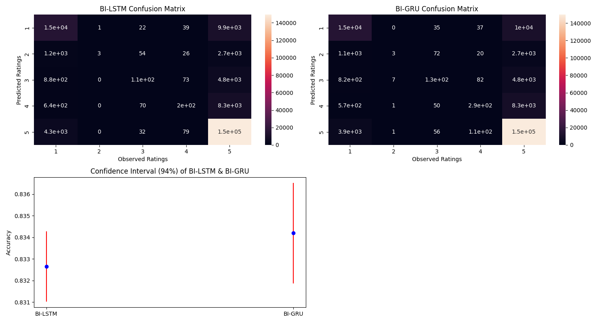
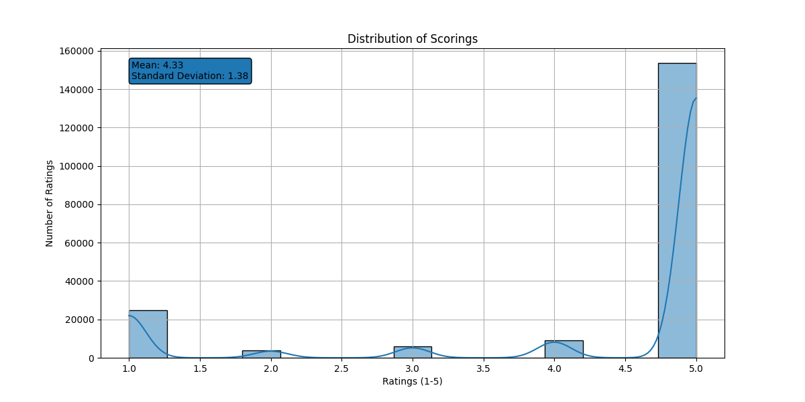
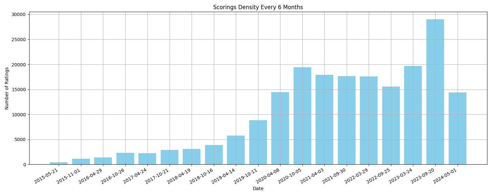
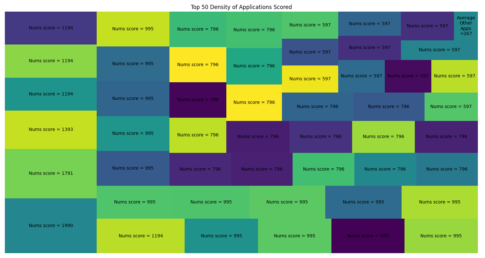

<div align="center">

# App Review Sentiment Intelligence

### Five-class sentiment classification with FastText and bidirectional recurrent networks

[](https://github.com/Dochikhoa2006/Sentiment-Analysis-Extended-RNNs/actions/workflows/ci.yml)
[](https://www.python.org/)
[](https://www.tensorflow.org/)
[](https://docs.astral.sh/ruff/)
[](LICENSE)

[Quick start](#quick-start) · [Architecture](#system-architecture) · [Results](#model-evaluation) · [Model card](docs/MODEL_CARD.md)

</div>

## Executive summary

This project builds an end-to-end NLP pipeline that maps a mobile application review to one of
five sentiment levels, represented by its 1–5 star rating. It combines Unicode-aware text
normalization, trainable FastText subword embeddings, and stacked bidirectional GRU/LSTM models.

The repository demonstrates more than model fitting: it includes distributed preprocessing,
exploratory analysis, statistically grounded cross-validation, memory-bounded training, artifact
management, a typed inference API, a production-style CLI, Docker packaging, and automated tests.

| Project dimension | Implementation |
|---|---|
| Dataset | 197,595 application reviews across 622 packages |
| Task | Five-class ordinal sentiment classification |
| Text representation | 130-dimensional FastText subword vectors |
| Input | Up to 150 tokens per review, masked after zero-padding |
| Models | Stacked bidirectional LSTM and GRU networks |
| Evaluation | Stratified K-fold accuracy, macro-F1, 95% CI, confusion matrix |
| Serving interface | Python API, CLI, and Docker entry point |

> [!IMPORTANT]
> Star ratings are used as a proxy for sentiment. The source dataset is strongly imbalanced—about
> 77.8% of the cleaned reviews are five-star ratings—so accuracy must be interpreted alongside
> macro-F1 and class-level errors.

## Model evaluation

The retained legacy experiment figure indicates the following benchmark after one training epoch:

| Architecture | Approximate plotted accuracy | Difference |
|---|---:|---:|
| Bidirectional LSTM | ≈83.27% | baseline |
| **Bidirectional GRU** | **≈83.42%** | **≈+0.15 pp** |

The fold-level arrays were not serialized, so these are visual estimates—not precision benchmark
claims. The original implementation used a 10-fold non-stratified split and a 94% interval; the
current pipeline upgrades evaluation to stratified K-fold validation, per-fold FastText fitting,
macro-F1, and 95% confidence intervals. Run `make evaluate` to produce a reproducible result set in
`artifacts/evaluation/`.

<details>
<summary>View the retained legacy experiment figure</summary>



> The original figure's confusion-matrix axis captions are reversed. The current evaluation code
> uses true ratings on rows and predicted ratings on columns.

</details>

## System architecture


```mermaid
flowchart LR
    A[Hugging Face dataset] --> B[PySpark validation and cleaning]
    B --> C[(Processed reviews)]
    C --> D[Unicode tokenization]
    D --> E[FastText subword model]
    E --> F[150 × 130 embedding batches]
    F --> G1[Stacked BiLSTM]
    F --> G2[Stacked BiGRU]
    G1 --> H[Stratified evaluation]
    G2 --> H
    H --> I[Selected BiGRU model]
    I --> J[Python API / CLI / Docker]
```

The training loader vectorizes only the active batch. For this dataset, eagerly materializing the
complete tensor would require roughly 14.4 GiB as `float32`; bounded batches make the same pipeline
usable on ordinary development machines.

See [Architecture](docs/ARCHITECTURE.md) for module responsibilities and design decisions.

## Exploratory analysis

<table>
  <tr>
    <td width="50%"></td>
    <td width="50%"></td>
  </tr>
  <tr>
    <td align="center"><strong>Class distribution</strong></td>
    <td align="center"><strong>Review activity over time</strong></td>
  </tr>
</table>

The imbalance is material: five-star reviews dominate the target distribution, while two- and
three-star feedback is comparatively rare. Training therefore supports balanced class weights,
and evaluation reports macro-F1 so minority classes have equal influence on the summary score.

<details>
<summary>Application coverage</summary>



</details>

## Repository structure

```text
.
├── .github/workflows/       # Continuous integration
├── artifacts/               # Local models and evaluation outputs (Git-ignored)
├── data/
│   ├── raw/                 # Downloaded source Parquet
│   ├── interim/             # Inspectable normalized corpus
│   └── processed/           # Validated modeling dataset
├── docs/
│   ├── assets/              # Portfolio visualizations
│   ├── ARCHITECTURE.md       # Technical design
│   └── MODEL_CARD.md         # Intended use, metrics, risks, limitations
├── src/sentiment_analyzer/
│   ├── cli.py               # Unified workflow interface
│   ├── data.py              # Download and Spark preprocessing
│   ├── embeddings.py        # FastText vectorizer
│   ├── modeling.py          # BiLSTM/BiGRU construction
│   ├── batching.py          # Memory-bounded Keras batches
│   ├── training.py          # Final training workflow
│   ├── evaluation.py        # Stratified cross-validation
│   └── inference.py         # Stable prediction API
├── tests/                    # Fast unit tests
├── Dockerfile
├── Makefile
└── pyproject.toml
```

## Quick start

### 1. Install

Python 3.11 or 3.12 and Java 17+ are recommended. Java is required only for the PySpark stages.

```bash
git clone https://github.com/Dochikhoa2006/Sentiment-Analysis-Extended-RNNs.git
cd Sentiment-Analysis-Extended-RNNs
python -m venv .venv
source .venv/bin/activate
python -m pip install --upgrade pip
pip install -e ".[all]"
```

### 2. Reproduce the pipeline

```bash
# Download LocalDoc/application_reviews from Hugging Face
sentiment-analyzer download

# Validate, clean, and convert labels from 1–5 to 0–4
sentiment-analyzer prepare

# Fit the FastText subword vectorizer
sentiment-analyzer embeddings

# Train the selected class-balanced BiGRU model
sentiment-analyzer train --architecture gru --epochs 5

# Classify a review
sentiment-analyzer predict --text "The latest update is fast and easy to use."
```

Example output:

```text
5/5 — strongly satisfied (confidence: 91.3%)
```

The confidence above illustrates the CLI format; the actual result depends on the trained
artifacts and random seed.

### 3. Compare architectures

```bash
sentiment-analyzer evaluate \
  --architectures lstm gru \
  --folds 5 \
  --epochs 1
```

Cross-validation intentionally fits FastText inside every training fold to prevent vocabulary and
embedding leakage from the held-out fold. This is computationally expensive but methodologically
clean.

## Python API

```python
from pathlib import Path

from sentiment_analyzer.inference import SentimentPredictor

predictor = SentimentPredictor.from_artifacts(
    Path("artifacts/fasttext_vectorizer.joblib"),
    Path("artifacts/sentiment_bigru.keras"),
)
prediction = predictor.predict("Useful app, but the login flow is unreliable.")
print(prediction.to_dict())
```

## Docker inference

The image contains the inference code but deliberately excludes large model files. Train locally
or retrieve trusted artifacts, then mount the artifact directory read-only:

```bash
docker build -t app-review-sentiment .
docker run --rm -it \
  -v "$(pwd)/artifacts:/app/artifacts:ro" \
  app-review-sentiment predict \
  --text "Simple, responsive, and reliable."
```

## Engineering quality

```bash
make install-dev
make lint
make test
```

Continuous integration runs linting and unit tests on Python 3.11 and 3.12. Generated datasets,
models, and experiment outputs remain outside Git; only code, documentation, and curated figures
are versioned.

## Dataset and responsible use

The project uses [LocalDoc/application_reviews](https://huggingface.co/datasets/LocalDoc/application_reviews),
which contains approximately 198k reviews and is distributed under **CC BY-NC 4.0**. The dataset is
downloaded at runtime and is not redistributed here.

Review text can contain personal, offensive, or culturally specific language. Predictions should
not be used for automated moderation, individual profiling, or consequential decisions. See the
[model card](docs/MODEL_CARD.md) for detailed limitations and evaluation expectations.

## License and attribution

Repository code and documentation are licensed under [CC BY 4.0](LICENSE). The dataset has separate
CC BY-NC 4.0 terms. Trained artifacts may be subject to the source dataset's non-commercial
restriction; verify those terms before distribution or deployment.

If this work supports your research or portfolio review, please cite:

```text
Do, Chi Khoa (2026). App Review Sentiment Intelligence:
FastText with Bidirectional Recurrent Neural Networks.
https://github.com/Dochikhoa2006/Sentiment-Analysis-Extended-RNNs
```

## Author

**Chi Khoa Do** · [GitHub](https://github.com/Dochikhoa2006) · [Email](mailto:dochikhoa2006@gmail.com)
